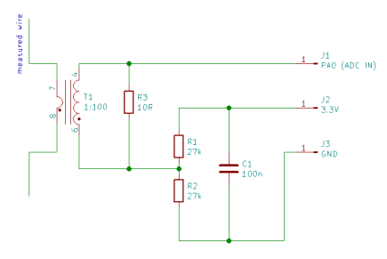

### AC Current Recorder

AC current recorder based on the blackpill STM32F411CEU.  
Device uses a current transformer for measure AC current.  
If the current is exceeded the threshold, a new data record will be written to SD in the data.csv file. 

### Project

The state_recorder directory contains a complete STM32CubeIDE project.

Device takes 4200 samples of the one signal period (50Hz) every 1s. The current transformer and measure resistor R3 ratio (current/voltage) is defined as the const value currentTransformerRatio in the input_monitor.h file. For my transformer it is 0.115V/A. You can update it value accordingly to yours transformer.
After acquisition a signal is filtered by simple the moving average filter.

When the current level is exceeded the threshold defined as const currentThreshold = 0.15A in the input_monitor.h file, the data starts to be integrate. The data is saved as a new record in the data.csv file after the current drops below the threshold.

A consumed energy is calculated with the voltage defined as const powerVoltage in the input_monitor.h file. Currently it is 230V.

It's best to open the data.csv in the LibreOffice Calc. The MS excel has problems with commas in floating point numbers. A single record in a CSV file has the form:  
`Index, name, event time, duration, avr. I [A], Energy [kWh]`

##### Branches

master - contain English version  
polish - contain Polish version

### Schema

Better resolution is in the schema.png file.

